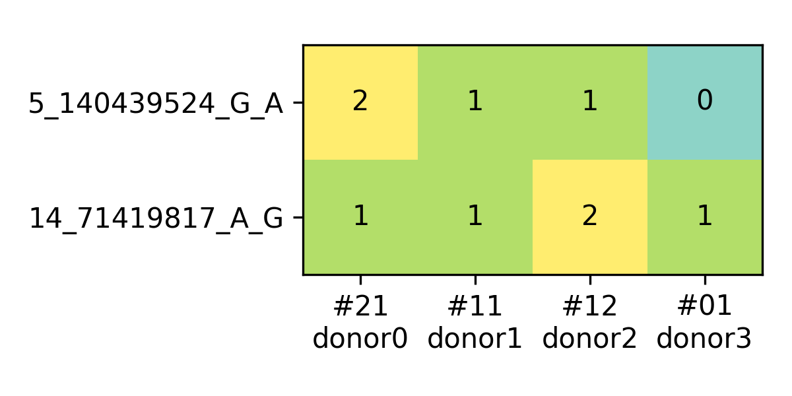

======
Manual
======

Demultiplexing requires two count matrices (variant-by-cell) of reads or UMIs 
for each variant in each cell: ``AD`` for alternative allele and ``DP`` depth 
(i.e., summary of alternative and reference alleles). These two matrices can be 
obtained by genotyping a list of variants in each cell. We provide a guideline 
for cellular genotyping_ with a recommendation of cellSNP-lite_ that is also 
developed by us.

Once the genotypes for each cell have been obtained, e.g., in VCF format, or two
sparse matrices ``AD`` and ``DP``, we can apply Vireo for demultiplexing.

Demultiplexing for donors
=========================

By default, Vireo works without any known genotype information for pooled 
samples. However, if any of genotype of these samples are known or can be 
obtained, e.g., by bulk RNA-seq, exome-seq, it is still useful to add them, not
only allowing us to align the deconvoluted samples to its identity, but also can 
benefits the doublets identification, especially if the coverage or the loaded 
cells per sample is low.

Depending the availability of genotype information, we provide four strategies 
to demultiplex scRNA-seq data.

1) without any genotype: 

   ::

      vireo -c $CELL_DATA -N $n_donor -o $OUT_DIR

2) with genotype for all samples (genoTag: GT, GP, or PL; default is PL, please 
   choose the existing one)

   ::

      vireo -c $CELL_DATA -d $DONOR_GT_FILE -o $OUT_DIR

   Optionally, `-N` can be provided if it is samller than that in DONOR_GT_FILE
   for finding the relevant subset of donors.

   .. note::
      For efficient loading of donor VCF file, we recommend subset it
      ``bcftools view donor.vcf.gz -R cellSNP.cells.vcf.gz -Oz -o sub.vcf.gz``
      
      You can also add ``-s`` or ``-S`` for subsetting samples. 

      Make sure you only keep informative SNPs, e.g., by filtering out SNPs
      with too much missing values or the gentoypes too similar across donors.

3) with genotype for part of the samples (n_donor is larger than that in 
   DONOR_GT_FILE)

   ::

      vireo -c $CELL_DATA -d $DONOR_GT_FILE -o $OUT_DIR -N $n_donor 

4) with genotype but not confident (or only for subset of SNPs)

   ::

      vireo -c $CELL_DATA -d $DONOR_GT_FILE -o $OUT_DIR --forceLearnGT

Formats of cell data
--------------------
Viroe supports the cell data in three formats:

1) a cellSNP output folder containing VCF for variants info and sparse matrices 
   ``AD`` and ``DP``
2) Vartrix outputs with three or four files: alt.mtx,ref.mtx,barcodes.tsv[,SNP.vcf.gz]
3) standard VCF file with variants by cells

Vireo full arguments
--------------------

Type ``vireo -h`` for details of all arguments:

.. code-block:: html

   Usage: vireo [options]

   Options:
   -h, --help            show this help message and exit
   -c CELL_DATA, --cellData=CELL_DATA
                           The cell genotype file in VCF format or cellSNP folder
                           with sparse matrices.
   -N N_DONOR, --nDonor=N_DONOR
                           Number of donors to demultiplex; can be larger than
                           provided in donor_file
   -o OUT_DIR, --outDir=OUT_DIR
                           Dirtectory for output files [default:
                           $cellFilePath/vireo]

   Optional input files:
      --vartrixData=VARTRIX_DATA
                           The cell genotype files in vartrix outputs (three/four
                           files, comma separated):
                           alt.mtx,ref.mtx,barcodes.tsv,SNPs.vcf.gz. This will
                           suppress cellData argument.
      -d DONOR_FILE, --donorFile=DONOR_FILE
                           The donor genotype file in VCF format. Please filter
                           the sample and region with bcftools -s and -R first!
      -t GENO_TAG, --genoTag=GENO_TAG
                           The tag for donor genotype: GT, GP, PL [default: PL]

   Optional arguments:
      --noDoublet         If use, not checking doublets.
      -M N_INIT, --nInit=N_INIT
                           Number of random initializations, when GT needs to
                           learn [default: 50]
      --extraDonor=N_EXTRA_DONOR
                           Number of extra donor in pre-cluster, when GT needs to
                           learn [default: 0]
      --extraDonorMode=EXTRA_DONOR_MODE
                           Method for searching from extra donors. size: n_cell
                           per donor; distance: GT distance between donors
                           [default: distance]
      --forceLearnGT      If use, treat donor GT as prior only.
      --ASEmode           If use, turn on SNP specific allelic ratio.
      --noPlot            If use, turn off plotting GT distance.
      --randSeed=RAND_SEED
                           Seed for random initialization [default: none]
      --cellRange=CELL_RANGE
                           Range of cells to process, eg. 0-10000 [default: all]
      --callAmbientRNAs   If use, detect ambient RNAs in each cell (under
                           development)
      -p NPROC, --nproc=NPROC
                           Number of subprocesses for computing - this sacrifices
                           memory for speedups [default: 1]

Discriminatory variants
=======================

Given a set of variants for which estimated genotypes are available, the Vireo 
software implements a heuristic to define a minimal and informative set of 
discriminatory variants. This set of variants can be used to perform qPCR-based 
genotyping or for other targeted genoytping methods. Briefly, this algorithm 
prioritises variants with largest information gain in splitting samples.

For any donor genotype file in VCF format, especially the output from Vireo, 
``GT_donors.vireo.vcf.gz``, the ``GTbarcode`` function can be used to generate 
the minimal set of discriminatory variants by the following command line:

::

   GTbarcode -i $dir/GT_donors.vireo.vcf.gz -o $dir/GT_barcodes.tsv --randSeed 1

By default, this function filters out variants with <20 UMIs or >0.05 reads 
aligned other alleles except the annotated reference and alternative alleles. 
In case the variants with homozygous alternative alleles are not wanted, the 
arguments ``--noHomoAlt`` can be used. By default, this ``GTbarcode`` function 
will also generate a figure for the identified genotype barcode, as following 
(based on example data in the repo),

Example data
============

In order to test vireo and illustrate the usage, we provide a test `data set`_,
also some `demo scripts`_.

This example data set contains 952 cells from 4 samples. The genotypes for these
four samples are also provided.

.. _genotyping: https://vireoSNP.readthedocs.io/en/latest/genotype.html
.. _cellSNP-lite: https://cellsnp-lite.readthedocs.io/en/latest/manual.html
.. _demo scripts: https://github.com/huangyh09/vireo/blob/master/examples/demo.sh
.. _data set: https://github.com/huangyh09/vireo/tree/master/data
